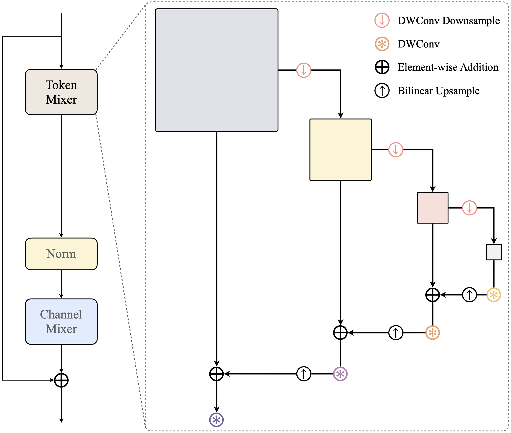
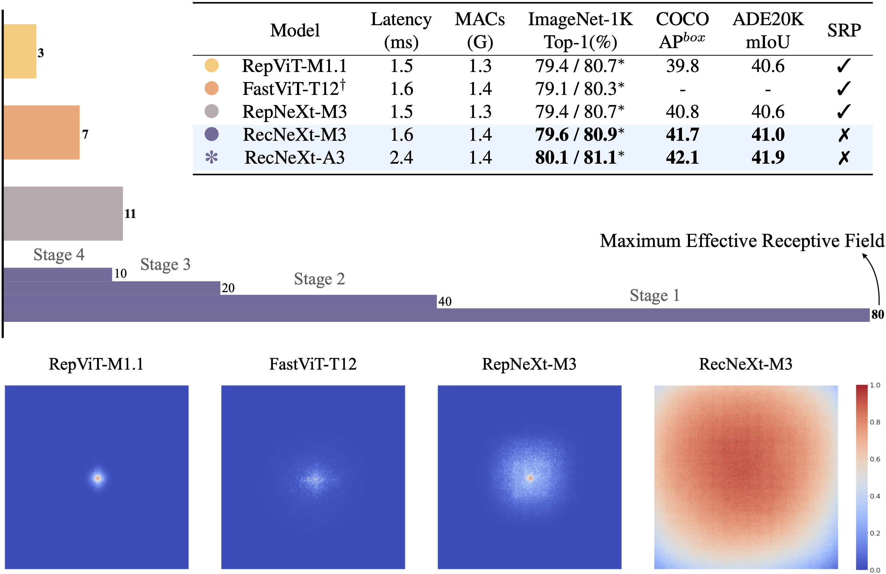
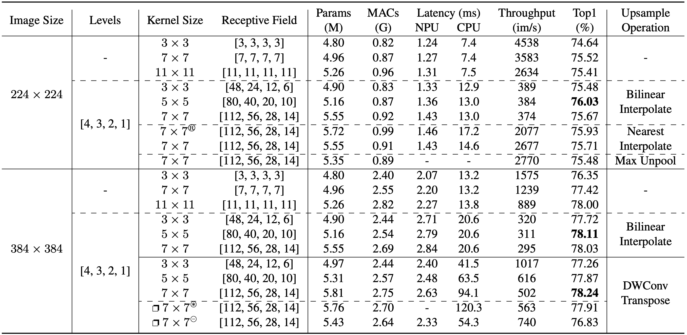

# [RecNeXt: Efficient Recursive Convolutions for Multi-Frequency Representations](https://arxiv.org/abs/2412.19628)

[](https://github.com/suous/RecNeXt/blob/main/LICENSE)
[](https://arxiv.org/abs/2412.19628)


<div style="display: flex; justify-content: space-between;">
    
    
</div>

<details>
  <summary>
  <span style="font-size: larger; ">RecConv Details</span>
  </summary>

  ```python
  class RecConv2d(nn.Module):
      def __init__(self, in_channels, kernel_size=5, bias=False, level=1, mode='bilinear'):
          super().__init__()
          self.level = level
          self.mode = mode
          kwargs = {
              'in_channels': in_channels, 
              'out_channels': in_channels, 
              'groups': in_channels,
              'kernel_size': kernel_size, 
              'padding': kernel_size // 2, 
              'bias': bias, 
          }
          self.down = nn.Conv2d(stride=2, **kwargs)
          self.convs = nn.ModuleList([nn.Conv2d(**kwargs) for _ in range(level+1)])
  
      def forward(self, x):
          i = x
          features = []
          for _ in range(self.level):
              x, s = self.down(x), x.shape[2:]
              features.append((x, s))
  
          x = 0
          for conv, (f, s) in zip(self.convs, reversed(features)):
              x = nn.functional.interpolate(conv(f + x), size=s, mode=self.mode)
          return self.convs[self.level](i + x)
  ```
</details>


## Abstract

This paper introduces RecConv, a recursive decomposition strategy that efficiently constructs multi-frequency representations using small-kernel convolutions. 
RecConv establishes a linear relationship between parameter growth and decomposing levels which determines the effective receptive field $k\times 2^\ell$ for a base kernel $k$ and $\ell$ levels of decomposition, while maintaining constant FLOPs regardless of the ERF expansion. 
Specifically, RecConv achieves a parameter expansion of only $\ell+2$ times and a maximum FLOPs increase of $5/3$ times, compared to the exponential growth ($4^\ell$) of standard and depthwise convolutions.
RecNeXt-M3 outperforms RepViT-M1.1 by 1.9 $AP^{box}$ on COCO with similar FLOPs.
This innovation provides a promising avenue towards designing efficient and compact networks across various modalities.

> Top-1 accuracy is evaluated on ImageNet-1K and the latency is assessed using an **iPhone 13 running iOS 18**, where all models are formatted into *mlmodel*.



<details>
  <summary>
  <span style="font-size: larger; ">Conclusion</span>
  </summary>
    This paper introduces a simple yet flexible recursive decomposition strategy using small-kernel convolutions to construct multi-frequency representations, maintaining linear parameter growth with decomposition levels while ensuring computational complexity decreases exponentially (following geometric progression). 
    Leveraging this framework, we construct RecConv as a plug-and-play module seamlessly integrable into existing vision architectures. 
    To the best of our knowledge, this is the first attempt with effective receptive field up to <b>80 x 80</b> for resource-constrained vision tasks. 
    Building on RecConv, we present RecNeXt, an efficient large-kernel vision backbone optimized towards resource-limited scenarios. 
    We introduce two series of models: the <b>A</b> series uses linear attention and nearest interpolation, while the <b>M</b> series employs convolution and bilinear interpolation for simplicity and broader hardware compatibility (e.g., to address sub-optimal nearest interpolation support in some iOS versions). 
    Extensive benchmarks demonstrate RecNeXt’s competitive performance over current leading approaches without requiring structural reparameterization or neural architecture search.
</details>

<br/>

**UPDATES** 🔥
- **2025/07/23**: Added a simple architecture, the overall design follows [LSNet](https://github.com/jameslahm/lsnet).
- **2025/07/04**: Uploaded classification models to [HuggingFace](https://huggingface.co/suous)🤗.
- **2025/07/01**: Added more comparisons with [LSNet](https://github.com/jameslahm/lsnet).
- **2025/06/27**: Added **A** series code and logs, replacing convolution with linear attention.
- **2025/03/19**: Added more ablation study results, including using attention with RecConv design.
- **2025/01/02**: Uploaded checkpoints and training logs of RecNeXt-M0.
- **2024/12/29**: Uploaded checkpoints and training logs of RecNeXt-M1 - M5.


## Classification on ImageNet-1K

### Models under the RepVit training strategy

We report the top-1 accuracy on ImageNet-1K with and without distillation using the same training strategy as [RepViT](https://github.com/THU-MIG/RepViT).

> **dist**: distillation; **norm**: without distillation (all models are trained over 300 epochs).

| Model |    Top-1     | Params | MACs | Latency |                                                                                                Ckpt                                                                                                |                                                                                                    Fused                                                                                                     |                                                       Log                                                       |                                               Core ML                                               |
|:------|:------------:|:------:|:----:|:-------:|:--------------------------------------------------------------------------------------------------------------------------------------------------------------------------------------------------:|:------------------------------------------------------------------------------------------------------------------------------------------------------------------------------------------------------------:|:---------------------------------------------------------------------------------------------------------------:|:---------------------------------------------------------------------------------------------------:|
| M0    | 74.7 \| 73.2 |  2.5M  | 0.4G |  1.0ms  | [dist](https://github.com/suous/RecNeXt/releases/download/v1.0/recnext_m0_distill_300e.pth) \| [norm](https://github.com/suous/RecNeXt/releases/download/v1.0/recnext_m0_without_distill_300e.pth) | [dist](https://github.com/suous/RecNeXt/releases/download/v1.0/recnext_m0_distill_300e_fused.pt) \| [norm](https://github.com/suous/RecNeXt/releases/download/v1.0/recnext_m0_without_distill_300e_fused.pt) | [dist](./logs/distill/recnext_m0_distill_300e.txt) \| [norm](./logs/normal/recnext_m0_without_distill_300e.txt) | [dist](https://github.com/suous/RecNeXt/releases/download/v1.0/recnext_m0_distill_300e_224.mlmodel) |
| M1    | 79.2 \| 78.0 |  5.2M  | 0.9G |  1.4ms  | [dist](https://github.com/suous/RecNeXt/releases/download/v1.0/recnext_m1_distill_300e.pth) \| [norm](https://github.com/suous/RecNeXt/releases/download/v1.0/recnext_m1_without_distill_300e.pth) | [dist](https://github.com/suous/RecNeXt/releases/download/v1.0/recnext_m1_distill_300e_fused.pt) \| [norm](https://github.com/suous/RecNeXt/releases/download/v1.0/recnext_m1_without_distill_300e_fused.pt) | [dist](./logs/distill/recnext_m1_distill_300e.txt) \| [norm](./logs/normal/recnext_m1_without_distill_300e.txt) | [dist](https://github.com/suous/RecNeXt/releases/download/v1.0/recnext_m1_distill_300e_224.mlmodel) |
| M2    | 80.3 \| 79.2 |  6.8M  | 1.2G |  1.5ms  | [dist](https://github.com/suous/RecNeXt/releases/download/v1.0/recnext_m2_distill_300e.pth) \| [norm](https://github.com/suous/RecNeXt/releases/download/v1.0/recnext_m2_without_distill_300e.pth) | [dist](https://github.com/suous/RecNeXt/releases/download/v1.0/recnext_m2_distill_300e_fused.pt) \| [norm](https://github.com/suous/RecNeXt/releases/download/v1.0/recnext_m2_without_distill_300e_fused.pt) | [dist](./logs/distill/recnext_m2_distill_300e.txt) \| [norm](./logs/normal/recnext_m2_without_distill_300e.txt) | [dist](https://github.com/suous/RecNeXt/releases/download/v1.0/recnext_m2_distill_300e_224.mlmodel) |
| M3    | 80.9 \| 79.6 |  8.2M  | 1.4G |  1.6ms  | [dist](https://github.com/suous/RecNeXt/releases/download/v1.0/recnext_m3_distill_300e.pth) \| [norm](https://github.com/suous/RecNeXt/releases/download/v1.0/recnext_m3_without_distill_300e.pth) | [dist](https://github.com/suous/RecNeXt/releases/download/v1.0/recnext_m3_distill_300e_fused.pt) \| [norm](https://github.com/suous/RecNeXt/releases/download/v1.0/recnext_m3_without_distill_300e_fused.pt) | [dist](./logs/distill/recnext_m3_distill_300e.txt) \| [norm](./logs/normal/recnext_m3_without_distill_300e.txt) | [dist](https://github.com/suous/RecNeXt/releases/download/v1.0/recnext_m3_distill_300e_224.mlmodel) |
| M4    | 82.5 \| 81.4 | 14.1M  | 2.4G |  2.4ms  | [dist](https://github.com/suous/RecNeXt/releases/download/v1.0/recnext_m4_distill_300e.pth) \| [norm](https://github.com/suous/RecNeXt/releases/download/v1.0/recnext_m4_without_distill_300e.pth) | [dist](https://github.com/suous/RecNeXt/releases/download/v1.0/recnext_m4_distill_300e_fused.pt) \| [norm](https://github.com/suous/RecNeXt/releases/download/v1.0/recnext_m4_without_distill_300e_fused.pt) | [dist](./logs/distill/recnext_m4_distill_300e.txt) \| [norm](./logs/normal/recnext_m4_without_distill_300e.txt) | [dist](https://github.com/suous/RecNeXt/releases/download/v1.0/recnext_m4_distill_300e_224.mlmodel) |
| M5    | 83.3 \| 82.9 | 22.9M  | 4.7G |  3.4ms  | [dist](https://github.com/suous/RecNeXt/releases/download/v1.0/recnext_m5_distill_300e.pth) \| [norm](https://github.com/suous/RecNeXt/releases/download/v1.0/recnext_m5_without_distill_300e.pth) | [dist](https://github.com/suous/RecNeXt/releases/download/v1.0/recnext_m5_distill_300e_fused.pt) \| [norm](https://github.com/suous/RecNeXt/releases/download/v1.0/recnext_m5_without_distill_300e_fused.pt) | [dist](./logs/distill/recnext_m5_distill_300e.txt) \| [norm](./logs/normal/recnext_m5_without_distill_300e.txt) | [dist](https://github.com/suous/RecNeXt/releases/download/v1.0/recnext_m5_distill_300e_224.mlmodel) |
| A0    | 75.0 \| 73.6 |  2.8M  | 0.4G |  1.4ms  | [dist](https://github.com/suous/RecNeXt/releases/download/v2.0/recnext_a0_distill_300e.pth) \| [norm](https://github.com/suous/RecNeXt/releases/download/v2.0/recnext_a0_without_distill_300e.pth) | [dist](https://github.com/suous/RecNeXt/releases/download/v2.0/recnext_a0_distill_300e_fused.pt) \| [norm](https://github.com/suous/RecNeXt/releases/download/v2.0/recnext_a0_without_distill_300e_fused.pt) | [dist](./logs/distill/recnext_a0_distill_300e.txt) \| [norm](./logs/normal/recnext_a0_without_distill_300e.txt) | [dist](https://github.com/suous/RecNeXt/releases/download/v2.0/recnext_a0_distill_300e_224.mlmodel) |
| A1    | 79.6 \| 78.3 |  5.9M  | 0.9G |  1.9ms  | [dist](https://github.com/suous/RecNeXt/releases/download/v2.0/recnext_a1_distill_300e.pth) \| [norm](https://github.com/suous/RecNeXt/releases/download/v2.0/recnext_a1_without_distill_300e.pth) | [dist](https://github.com/suous/RecNeXt/releases/download/v2.0/recnext_a1_distill_300e_fused.pt) \| [norm](https://github.com/suous/RecNeXt/releases/download/v2.0/recnext_a1_without_distill_300e_fused.pt) | [dist](./logs/distill/recnext_a1_distill_300e.txt) \| [norm](./logs/normal/recnext_a1_without_distill_300e.txt) | [dist](https://github.com/suous/RecNeXt/releases/download/v2.0/recnext_a1_distill_300e_224.mlmodel) |
| A2    | 80.8 \| 79.6 |  7.9M  | 1.2G |  2.2ms  | [dist](https://github.com/suous/RecNeXt/releases/download/v2.0/recnext_a2_distill_300e.pth) \| [norm](https://github.com/suous/RecNeXt/releases/download/v2.0/recnext_a2_without_distill_300e.pth) | [dist](https://github.com/suous/RecNeXt/releases/download/v2.0/recnext_a2_distill_300e_fused.pt) \| [norm](https://github.com/suous/RecNeXt/releases/download/v2.0/recnext_a2_without_distill_300e_fused.pt) | [dist](./logs/distill/recnext_a2_distill_300e.txt) \| [norm](./logs/normal/recnext_a2_without_distill_300e.txt) | [dist](https://github.com/suous/RecNeXt/releases/download/v2.0/recnext_a2_distill_300e_224.mlmodel) |
| A3    | 81.1 \| 80.1 |  9.0M  | 1.4G |  2.4ms  | [dist](https://github.com/suous/RecNeXt/releases/download/v2.0/recnext_a3_distill_300e.pth) \| [norm](https://github.com/suous/RecNeXt/releases/download/v2.0/recnext_a3_without_distill_300e.pth) | [dist](https://github.com/suous/RecNeXt/releases/download/v2.0/recnext_a3_distill_300e_fused.pt) \| [norm](https://github.com/suous/RecNeXt/releases/download/v2.0/recnext_a3_without_distill_300e_fused.pt) | [dist](./logs/distill/recnext_a3_distill_300e.txt) \| [norm](./logs/normal/recnext_a3_without_distill_300e.txt) | [dist](https://github.com/suous/RecNeXt/releases/download/v2.0/recnext_a3_distill_300e_224.mlmodel) |
| A4    | 82.5 \| 81.6 | 15.8M  | 2.4G |  3.6ms  | [dist](https://github.com/suous/RecNeXt/releases/download/v2.0/recnext_a4_distill_300e.pth) \| [norm](https://github.com/suous/RecNeXt/releases/download/v2.0/recnext_a4_without_distill_300e.pth) | [dist](https://github.com/suous/RecNeXt/releases/download/v2.0/recnext_a4_distill_300e_fused.pt) \| [norm](https://github.com/suous/RecNeXt/releases/download/v2.0/recnext_a4_without_distill_300e_fused.pt) | [dist](./logs/distill/recnext_a4_distill_300e.txt) \| [norm](./logs/normal/recnext_a4_without_distill_300e.txt) | [dist](https://github.com/suous/RecNeXt/releases/download/v2.0/recnext_a4_distill_300e_224.mlmodel) |
| A5    | 83.5 \| 83.1 | 25.7M  | 4.7G |  5.6ms  | [dist](https://github.com/suous/RecNeXt/releases/download/v2.0/recnext_a5_distill_300e.pth) \| [norm](https://github.com/suous/RecNeXt/releases/download/v2.0/recnext_a5_without_distill_300e.pth) | [dist](https://github.com/suous/RecNeXt/releases/download/v2.0/recnext_a5_distill_300e_fused.pt) \| [norm](https://github.com/suous/RecNeXt/releases/download/v2.0/recnext_a5_without_distill_300e_fused.pt) | [dist](./logs/distill/recnext_a5_distill_300e.txt) \| [norm](./logs/normal/recnext_a5_without_distill_300e.txt) | [dist](https://github.com/suous/RecNeXt/releases/download/v2.0/recnext_a5_distill_300e_224.mlmodel) |


```bash
# this script is used to validate the distillation results
fd txt logs/distill -x sh -c 'printf "%.1f %s\n" "$(jq -s "map(.test_acc1) | max" {})" "{}"' | sort -k2
```

<details>
  <summary>
  <span>output</span>
  </summary>

```
75.0 logs/distill/recnext_a0_distill_300e.txt
79.6 logs/distill/recnext_a1_distill_300e.txt
80.8 logs/distill/recnext_a2_distill_300e.txt
81.1 logs/distill/recnext_a3_distill_300e.txt
82.5 logs/distill/recnext_a4_distill_300e.txt
83.5 logs/distill/recnext_a5_distill_300e.txt
74.7 logs/distill/recnext_m0_distill_300e.txt
79.2 logs/distill/recnext_m1_distill_300e.txt
80.3 logs/distill/recnext_m2_distill_300e.txt
80.9 logs/distill/recnext_m3_distill_300e.txt
82.5 logs/distill/recnext_m4_distill_300e.txt
83.3 logs/distill/recnext_m5_distill_300e.txt
```
</details>

```bash
# this script is used to validate the results without distillation
fd txt logs/normal -x sh -c 'printf "%.1f %s\n" "$(jq -s "map(.test_acc1) | max" {})" "{}"' | sort -k2
```

<details>
  <summary>
  <span>output</span>
  </summary>

```
73.6 logs/normal/recnext_a0_without_distill_300e.txt
78.3 logs/normal/recnext_a1_without_distill_300e.txt
79.6 logs/normal/recnext_a2_without_distill_300e.txt
80.1 logs/normal/recnext_a3_without_distill_300e.txt
81.6 logs/normal/recnext_a4_without_distill_300e.txt
83.1 logs/normal/recnext_a5_without_distill_300e.txt
73.2 logs/normal/recnext_m0_without_distill_300e.txt
78.0 logs/normal/recnext_m1_without_distill_300e.txt
79.2 logs/normal/recnext_m2_without_distill_300e.txt
79.6 logs/normal/recnext_m3_without_distill_300e.txt
81.4 logs/normal/recnext_m4_without_distill_300e.txt
82.9 logs/normal/recnext_m5_without_distill_300e.txt
81.1 logs/normal/z_without_drop_path_recnext_m4_without_distill_300e.txt
81.6 logs/normal/z_without_drop_path_recnext_m5_without_distill_300e.txt
```
</details>


Tips: Convert a training-time RecNeXt into the inference-time structure
```
from timm.models import create_model
import utils

model = create_model('recnext_m1')
utils.replace_batchnorm(model)
```

## Latency Measurement 

The latency reported in RecNeXt for iPhone 13 (iOS 18) uses the benchmark tool from [XCode 14](https://developer.apple.com/videos/play/wwdc2022/10027/).

<details>
<summary>
RecNeXt-M0
</summary>

</details>

<details>
<summary>
RecNeXt-M1
</summary>

</details>

<details>
<summary>
RecNeXt-M2
</summary>

</details>

<details>
<summary>
RecNeXt-M3
</summary>

</details>

<details>
<summary>
RecNeXt-M4
</summary>

</details>

<details>
<summary>
RecNeXt-M5
</summary>

</details>

<details>
<summary>
RecNeXt-A0
</summary>

</details>

<details>
<summary>
RecNeXt-A1
</summary>

</details>

<details>
<summary>
RecNeXt-A2
</summary>

</details>

<details>
<summary>
RecNeXt-A3
</summary>

</details>

<details>
<summary>
RecNeXt-A4
</summary>

</details>

<details>
<summary>
RecNeXt-A5
</summary>

</details>

Tips: export the model to Core ML model
```
python export_coreml.py --model recnext_m1 --ckpt pretrain/recnext_m1_distill_300e.pth
```
Tips: measure the throughput on GPU
```
python speed_gpu.py --model recnext_m1
```

## ImageNet  

### Prerequisites
`conda` virtual environment is recommended. 
```
conda create -n recnext python=3.8
pip install -r requirements.txt
```

### Data preparation

Download and extract ImageNet train and val images from http://image-net.org/. The training and validation data are expected to be in the `train` folder and `val` folder respectively:

```bash
# script to extract ImageNet dataset: https://github.com/pytorch/examples/blob/main/imagenet/extract_ILSVRC.sh
# ILSVRC2012_img_train.tar (about 138 GB)
# ILSVRC2012_img_val.tar (about 6.3 GB)
```

```
# organize the ImageNet dataset as follows:
imagenet
├── train
│   ├── n01440764
│   │   ├── n01440764_10026.JPEG
│   │   ├── n01440764_10027.JPEG
│   │   ├── ......
│   ├── ......
├── val
│   ├── n01440764
│   │   ├── ILSVRC2012_val_00000293.JPEG
│   │   ├── ILSVRC2012_val_00002138.JPEG
│   │   ├── ......
│   ├── ......
```

### Training
To train RecNeXt-M1 on an 8-GPU machine:

```
python -m torch.distributed.launch --nproc_per_node=8 --master_port 12346 --use_env main.py --model recnext_m1 --data-path ~/imagenet --dist-eval
```
Tips: specify your data path and model name! 

### Testing 
For example, to test RecNeXt-M1:
```
python main.py --eval --model recnext_m1 --resume pretrain/recnext_m1_distill_300e.pth --data-path ~/imagenet
```

Use pretrained model without knowledge distillation from [HuggingFace](https://huggingface.co/suous) 🤗.
```bash
python main.py --eval --model recnext_m1 --data-path ~/imagenet --pretrained --distillation-type none
```

Use pretrained model with knowledge distillation from [HuggingFace](https://huggingface.co/suous) 🤗.
```bash
python main.py --eval --model recnext_m1 --data-path ~/imagenet --pretrained --distillation-type hard
```

### Fused model evaluation
For example, to evaluate RecNeXt-M1 with the fused model: [](https://colab.research.google.com/github/suous/RecNeXt/blob/main/demo/fused_model_evaluation.ipynb)
```
python fuse_eval.py --model recnext_m1 --resume pretrain/recnext_m1_distill_300e_fused.pt --data-path ~/imagenet
```

### Extract model for publishing

```
# without distillation
python publish.py --model_name recnext_m1 --checkpoint_path pretrain/checkpoint_best.pth --epochs 300

# with distillation
python publish.py --model_name recnext_m1 --checkpoint_path pretrain/checkpoint_best.pth --epochs 300 --distillation

# fused model
python publish.py --model_name recnext_m1 --checkpoint_path pretrain/checkpoint_best.pth --epochs 300 --fused
```

## Downstream Tasks
[Object Detection and Instance Segmentation](detection/README.md)<br>

| Model      | $AP^b$ | $AP_{50}^b$ | $AP_{75}^b$ | $AP^m$ | $AP_{50}^m$ | $AP_{75}^m$ | Latency |                                       Ckpt                                        |                     Log                     |
|:-----------|:------:|:-----------:|:-----------:|:------:|:-----------:|:-----------:|:-------:|:---------------------------------------------------------------------------------:|:-------------------------------------------:|
| RecNeXt-M3 |  41.7  |    63.4     |    45.4     |  38.6  |    60.5     |    41.4     |  5.2ms  | [M3](https://github.com/suous/RecNeXt/releases/download/v1.0/recnext_m3_coco.pth) | [M3](./detection/logs/recnext_m3_coco.json) |
| RecNeXt-M4 |  43.5  |    64.9     |    47.7     |  39.7  |    62.1     |    42.4     |  7.6ms  | [M4](https://github.com/suous/RecNeXt/releases/download/v1.0/recnext_m4_coco.pth) | [M4](./detection/logs/recnext_m4_coco.json) |
| RecNeXt-M5 |  44.6  |    66.3     |    49.0     |  40.6  |    63.5     |    43.5     | 12.4ms  | [M5](https://github.com/suous/RecNeXt/releases/download/v1.0/recnext_m5_coco.pth) | [M5](./detection/logs/recnext_m5_coco.json) |
| RecNeXt-A3 |  42.1  |    64.1     |    46.2     |  38.8  |    61.1     |    41.6     |  8.3ms  | [A3](https://github.com/suous/RecNeXt/releases/download/v2.0/recnext_a3_coco.pth) | [A3](./detection/logs/recnext_a3_coco.json) |
| RecNeXt-A4 |  43.5  |    65.4     |    47.6     |  39.8  |    62.4     |    42.9     | 14.0ms  | [A4](https://github.com/suous/RecNeXt/releases/download/v2.0/recnext_a4_coco.pth) | [A4](./detection/logs/recnext_a4_coco.json) |
| RecNeXt-A5 |  44.4  |    66.3     |    48.9     |  40.3  |    63.3     |    43.4     | 25.3ms  | [A5](https://github.com/suous/RecNeXt/releases/download/v2.0/recnext_a5_coco.pth) | [A5](./detection/logs/recnext_a5_coco.json) |
```bash
# this script is used to validate the detection results
fd json detection/logs -x sh -c 'printf "%.1f %s\n" "$(tail -n +2 {} | jq -s "map(.bbox_mAP) | max * 100")" "{}"' | sort -k2
```

<details>
  <summary>
  <span>output</span>
  </summary>

```
42.1 detection/logs/recnext_a3_coco.json
43.5 detection/logs/recnext_a4_coco.json
44.4 detection/logs/recnext_a5_coco.json
41.7 detection/logs/recnext_m3_coco.json
43.5 detection/logs/recnext_m4_coco.json
44.6 detection/logs/recnext_m5_coco.json
```
</details>

[Semantic Segmentation](segmentation/README.md)

| Model      | mIoU | Latency |                                        Ckpt                                         |                       Log                        |
|:-----------|:----:|:-------:|:-----------------------------------------------------------------------------------:|:------------------------------------------------:|
| RecNeXt-M3 | 41.0 |  5.6ms  | [M3](https://github.com/suous/RecNeXt/releases/download/v1.0/recnext_m3_ade20k.pth) | [M3](./segmentation/logs/recnext_m3_ade20k.json) |
| RecNeXt-M4 | 43.6 |  7.2ms  | [M4](https://github.com/suous/RecNeXt/releases/download/v1.0/recnext_m4_ade20k.pth) | [M4](./segmentation/logs/recnext_m4_ade20k.json) |
| RecNeXt-M5 | 46.0 | 12.4ms  | [M5](https://github.com/suous/RecNeXt/releases/download/v1.0/recnext_m5_ade20k.pth) | [M5](./segmentation/logs/recnext_m5_ade20k.json) |
| RecNeXt-A3 | 41.9 |  8.4ms  | [A3](https://github.com/suous/RecNeXt/releases/download/v2.0/recnext_a3_ade20k.pth) | [A3](./segmentation/logs/recnext_a3_ade20k.json) |
| RecNeXt-A4 | 43.0 | 14.0ms  | [A4](https://github.com/suous/RecNeXt/releases/download/v2.0/recnext_a4_ade20k.pth) | [A4](./segmentation/logs/recnext_a4_ade20k.json) |
| RecNeXt-A5 | 46.5 | 25.3ms  | [A5](https://github.com/suous/RecNeXt/releases/download/v2.0/recnext_a5_ade20k.pth) | [A5](./segmentation/logs/recnext_a5_ade20k.json) |
```bash
# this script is used to validate the segmentation results
fd json segmentation/logs -x sh -c 'printf "%.1f %s\n" "$(tail -n +2 {} | jq -s "map(.mIoU) | max * 100")" "{}"' | sort -k2
```

<details>
  <summary>
  <span>output</span>
  </summary>

```
41.9 segmentation/logs/recnext_a3_ade20k.json
43.0 segmentation/logs/recnext_a4_ade20k.json
46.5 segmentation/logs/recnext_a5_ade20k.json
41.0 segmentation/logs/recnext_m3_ade20k.json
43.6 segmentation/logs/recnext_m4_ade20k.json
46.0 segmentation/logs/recnext_m5_ade20k.json
```
</details>

## Ablation Study

### Overall Experiments



<details>
  <summary>
  <span style="font-size: larger; ">Ablation Logs</span>
  </summary>

<pre>
logs/ablation
├── 224
│   ├── <a style="text-decoration:none" href="./logs/ablation/224/recnext_m1_120e_224x224_3x3_7464.txt">recnext_m1_120e_224x224_3x3_7464.txt</a>
│   ├── <a style="text-decoration:none" href="./logs/ablation/224/recnext_m1_120e_224x224_7x7_7552.txt">recnext_m1_120e_224x224_7x7_7552.txt</a>
│   ├── <a style="text-decoration:none" href="./logs/ablation/224/recnext_m1_120e_224x224_bxb_7541.txt">recnext_m1_120e_224x224_bxb_7541.txt</a>
│   ├── <a style="text-decoration:none" href="./logs/ablation/224/recnext_m1_120e_224x224_rec_3x3_7548.txt">recnext_m1_120e_224x224_rec_3x3_7548.txt</a>
│   ├── <a style="text-decoration:none" href="./logs/ablation/224/recnext_m1_120e_224x224_rec_5x5_7603.txt">recnext_m1_120e_224x224_rec_5x5_7603.txt</a>
│   ├── <a style="text-decoration:none" href="./logs/ablation/224/recnext_m1_120e_224x224_rec_7x7_7567.txt">recnext_m1_120e_224x224_rec_7x7_7567.txt</a>
│   ├── <a style="text-decoration:none" href="./logs/ablation/224/recnext_m1_120e_224x224_rec_7x7_nearest_7571.txt">recnext_m1_120e_224x224_rec_7x7_nearest_7571.txt</a>
│   └── <a style="text-decoration:none" href="./logs/ablation/224/recnext_m1_120e_224x224_rec_7x7_unpool_7548.txt">recnext_m1_120e_224x224_rec_7x7_unpool_7548.txt</a>
└── 384
    ├── <a style="text-decoration:none" href="./logs/ablation/384/recnext_m1_120e_384x384_3x3_7635.txt">recnext_m1_120e_384x384_3x3_7635.txt</a>
    ├── <a style="text-decoration:none" href="./logs/ablation/384/recnext_m1_120e_384x384_7x7_7742.txt">recnext_m1_120e_384x384_7x7_7742.txt</a>
    ├── <a style="text-decoration:none" href="./logs/ablation/384/recnext_m1_120e_384x384_bxb_7800.txt">recnext_m1_120e_384x384_bxb_7800.txt</a>
    ├── <a style="text-decoration:none" href="./logs/ablation/384/recnext_m1_120e_384x384_rec_3x3_7772.txt">recnext_m1_120e_384x384_rec_3x3_7772.txt</a>
    ├── <a style="text-decoration:none" href="./logs/ablation/384/recnext_m1_120e_384x384_rec_5x5_7811.txt">recnext_m1_120e_384x384_rec_5x5_7811.txt</a>
    ├── <a style="text-decoration:none" href="./logs/ablation/384/recnext_m1_120e_384x384_rec_7x7_7803.txt">recnext_m1_120e_384x384_rec_7x7_7803.txt</a>
    ├── <a style="text-decoration:none" href="./logs/ablation/384/recnext_m1_120e_384x384_rec_convtrans_3x3_basic_7726.txt">recnext_m1_120e_384x384_rec_convtrans_3x3_basic_7726.txt</a>
    ├── <a style="text-decoration:none" href="./logs/ablation/384/recnext_m1_120e_384x384_rec_convtrans_5x5_basic_7787.txt">recnext_m1_120e_384x384_rec_convtrans_5x5_basic_7787.txt</a>
    ├── <a style="text-decoration:none" href="./logs/ablation/384/recnext_m1_120e_384x384_rec_convtrans_7x7_basic_7824.txt">recnext_m1_120e_384x384_rec_convtrans_7x7_basic_7824.txt</a>
    ├── <a style="text-decoration:none" href="./logs/ablation/384/recnext_m1_120e_384x384_rec_convtrans_7x7_group_7791.txt">recnext_m1_120e_384x384_rec_convtrans_7x7_group_7791.txt</a>
    └── <a style="text-decoration:none" href="./logs/ablation/384/recnext_m1_120e_384x384_rec_convtrans_7x7_split_7683.txt">recnext_m1_120e_384x384_rec_convtrans_7x7_split_7683.txt</a>
</pre>

```bash
# this script is used to validate the ablation results
fd txt logs/ablation -x sh -c 'printf "%.2f %s\n" "$(jq -s "map(.test_acc1) | max" {})" "{}"' | sort -k2
```

<details>
  <summary>
  <span>output</span>
  </summary>

```
74.64 logs/ablation/224/recnext_m1_120e_224x224_3x3_7464.txt
75.52 logs/ablation/224/recnext_m1_120e_224x224_7x7_7552.txt
75.41 logs/ablation/224/recnext_m1_120e_224x224_bxb_7541.txt
75.48 logs/ablation/224/recnext_m1_120e_224x224_rec_3x3_7548.txt
76.03 logs/ablation/224/recnext_m1_120e_224x224_rec_5x5_7603.txt
75.67 logs/ablation/224/recnext_m1_120e_224x224_rec_7x7_7567.txt
75.71 logs/ablation/224/recnext_m1_120e_224x224_rec_7x7_nearest_7571.txt
75.48 logs/ablation/224/recnext_m1_120e_224x224_rec_7x7_unpool_7548.txt
76.35 logs/ablation/384/recnext_m1_120e_384x384_3x3_7635.txt
77.42 logs/ablation/384/recnext_m1_120e_384x384_7x7_7742.txt
78.00 logs/ablation/384/recnext_m1_120e_384x384_bxb_7800.txt
77.72 logs/ablation/384/recnext_m1_120e_384x384_rec_3x3_7772.txt
78.11 logs/ablation/384/recnext_m1_120e_384x384_rec_5x5_7811.txt
78.03 logs/ablation/384/recnext_m1_120e_384x384_rec_7x7_7803.txt
77.26 logs/ablation/384/recnext_m1_120e_384x384_rec_convtrans_3x3_basic_7726.txt
77.87 logs/ablation/384/recnext_m1_120e_384x384_rec_convtrans_5x5_basic_7787.txt
78.24 logs/ablation/384/recnext_m1_120e_384x384_rec_convtrans_7x7_basic_7824.txt
77.91 logs/ablation/384/recnext_m1_120e_384x384_rec_convtrans_7x7_group_7791.txt
76.84 logs/ablation/384/recnext_m1_120e_384x384_rec_convtrans_7x7_split_7683.txt
```
</details>

</details>

### RecConv Variants

<div style="display: flex; justify-content: space-between;">
    
    
</div>


<details>
  <summary>
  <span style="font-size: larger; ">RecConv Variant Details</span>
  </summary>

- **RecConv using group convolutions**

```python
# RecConv Variant A
# recursive decomposition on both spatial and channel dimensions
# downsample and upsample through group convolutions
class RecConv2d(nn.Module):
    def __init__(self, in_channels, kernel_size=5, bias=False, level=2):
        super().__init__()
        self.level = level
        kwargs = {'kernel_size': kernel_size, 'padding': kernel_size // 2, 'bias': bias}
        downs = []
        for l in range(level):
            i_channels = in_channels // (2 ** l)
            o_channels = in_channels // (2 ** (l+1))
            downs.append(nn.Conv2d(in_channels=i_channels, out_channels=o_channels, groups=o_channels, stride=2, **kwargs))
        self.downs = nn.ModuleList(downs)

        convs = []
        for l in range(level+1):
            channels = in_channels // (2 ** l)
            convs.append(nn.Conv2d(in_channels=channels, out_channels=channels, groups=channels, **kwargs))
        self.convs = nn.ModuleList(reversed(convs))

        # this is the simplest modification, only support resoltions like 256, 384, etc
        kwargs['kernel_size'] = kernel_size + 1
        ups = []
        for l in range(level):
            i_channels = in_channels // (2 ** (l+1))
            o_channels = in_channels // (2 ** l)
            ups.append(nn.ConvTranspose2d(in_channels=i_channels, out_channels=o_channels, groups=i_channels, stride=2, **kwargs))
        self.ups = nn.ModuleList(reversed(ups))
        
    def forward(self, x):
        i = x
        features = []
        for down in self.downs:
            x, s = down(x), x.shape[2:]
            features.append((x, s))

        x = 0
        for conv, up, (f, s) in zip(self.convs, self.ups, reversed(features)):
            x = up(conv(f + x))
        return self.convs[self.level](i + x)
```

- **RecConv using channel-wise concatenation**

```python
# recursive decomposition on both spatial and channel dimensions
# downsample using channel-wise split, followed by depthwise convolution with a stride of 2
# upsample through channel-wise concatenation
class RecConv2d(nn.Module):
    def __init__(self, in_channels, kernel_size=5, bias=False, level=2):
        super().__init__()
        self.level = level
        kwargs = {'kernel_size': kernel_size, 'padding': kernel_size // 2, 'bias': bias}
        downs = []
        for l in range(level):
            channels = in_channels // (2 ** (l+1))
            downs.append(nn.Conv2d(in_channels=channels, out_channels=channels, groups=channels, stride=2, **kwargs))
        self.downs = nn.ModuleList(downs)

        convs = []
        for l in range(level+1):
            channels = in_channels // (2 ** l)
            convs.append(nn.Conv2d(in_channels=channels, out_channels=channels, groups=channels, **kwargs))
        self.convs = nn.ModuleList(reversed(convs))

 .      # this is the simplest modification, only support resoltions like 256, 384, etc
        kwargs['kernel_size'] = kernel_size + 1
        ups = []
        for l in range(level):
            channels = in_channels // (2 ** (l+1))
            ups.append(nn.ConvTranspose2d(in_channels=channels, out_channels=channels, groups=channels, stride=2, **kwargs))
        self.ups = nn.ModuleList(reversed(ups))

    def forward(self, x):
        features = []
        for down in self.downs:
            r, x = torch.chunk(x, 2, dim=1)
            x, s = down(x), x.shape[2:]
            features.append((r, s))

        for conv, up, (r, s) in zip(self.convs, self.ups, reversed(features)):
            x = torch.cat([r, up(conv(x))], dim=1)
        return self.convs[self.level](x)
```
</details>

### RecConv Beyond

We apply RecConv to [MLLA](https://github.com/LeapLabTHU/MLLA) small variants, replacing linear attention and downsampling layers. 
Result in higher throughput and less training memory usage.

<pre>
mlla/logs
├── 1_mlla_nano
│   ├── <a style="text-decoration:none" href="./mlla/logs/1_mlla_nano/01_baseline.txt">01_baseline.txt</a>
│   ├── <a style="text-decoration:none" href="./mlla/logs/1_mlla_nano/02_recconv_5x5_conv_trans.txt">02_recconv_5x5_conv_trans.txt</a>
│   ├── <a style="text-decoration:none" href="./mlla/logs/1_mlla_nano/03_recconv_5x5_nearest_interp.txt">03_recconv_5x5_nearest_interp.txt</a>
│   ├── <a style="text-decoration:none" href="./mlla/logs/1_mlla_nano/04_recattn_nearest_interp.txt">04_recattn_nearest_interp.txt</a>
│   └── <a style="text-decoration:none" href="./mlla/logs/1_mlla_nano/05_recattn_nearest_interp_simplify.txt">05_recattn_nearest_interp_simplify.txt</a>
└── 2_mlla_mini
    ├── <a style="text-decoration:none" href="./mlla/logs/2_mlla_mini/01_baseline.txt">01_baseline.txt</a>
    ├── <a style="text-decoration:none" href="./mlla/logs/2_mlla_mini/02_recconv_5x5_conv_trans.txt">02_recconv_5x5_conv_trans.txt</a>
    ├── <a style="text-decoration:none" href="./mlla/logs/2_mlla_mini/03_recconv_5x5_nearest_interp.txt">03_recconv_5x5_nearest_interp.txt</a>
    ├── <a style="text-decoration:none" href="./mlla/logs/2_mlla_mini/04_recattn_nearest_interp.txt">04_recattn_nearest_interp.txt</a>
    └── <a style="text-decoration:none" href="./mlla/logs/2_mlla_mini/05_recattn_nearest_interp_simplify.txt">05_recattn_nearest_interp_simplify.txt</a>
</pre>


```bash
# this script is used to validate the ablation results
fd txt mlla/logs -x sh -c 'printf "%.2f %s\n" "$(rg -N -I -U -o "EPOCH.*\n.*Acc@1 (\d+\.\d+)" -r "\$1" {} | sort -n | tail -1)" "{}"' | sort -k2
```

<details>
  <summary>
  <span>output</span>
  </summary>

```
76.26 mlla/logs/1_mlla_nano/01_baseline.txt
77.09 mlla/logs/1_mlla_nano/02_recconv_5x5_conv_trans.txt
77.14 mlla/logs/1_mlla_nano/03_recconv_5x5_nearest_interp.txt
76.53 mlla/logs/1_mlla_nano/04_recattn_nearest_interp.txt
77.28 mlla/logs/1_mlla_nano/05_recattn_nearest_interp_simplify.txt
82.27 mlla/logs/2_mlla_mini/01_baseline.txt
82.06 mlla/logs/2_mlla_mini/02_recconv_5x5_conv_trans.txt
81.94 mlla/logs/2_mlla_mini/03_recconv_5x5_nearest_interp.txt
82.08 mlla/logs/2_mlla_mini/04_recattn_nearest_interp.txt
82.16 mlla/logs/2_mlla_mini/05_recattn_nearest_interp_simplify.txt
```
</details>

## Limitations

1. RecNeXt exhibits the lowest **throughput** among models of comparable parameter size due to extensive use of bilinear interpolation, which can be mitigated by employing transposed convolution.
2. The recursive decomposition may introduce **numerical instability** during mixed precision training, which can be alleviated by using fixed-point or BFloat16 arithmetic.
3. **Compatibility issues** with bilinear interpolation and transposed convolution on certain iOS versions may also result in performance degradation.

## Acknowledgement

Classification (ImageNet) code base is partly built with [LeViT](https://github.com/facebookresearch/LeViT), [PoolFormer](https://github.com/sail-sg/poolformer), [EfficientFormer](https://github.com/snap-research/EfficientFormer),  [RepViT](https://github.com/THU-MIG/RepViT), and [MogaNet](https://github.com/Westlake-AI/MogaNet).

The detection and segmentation pipeline is from [MMCV](https://github.com/open-mmlab/mmcv) ([MMDetection](https://github.com/open-mmlab/mmdetection) and [MMSegmentation](https://github.com/open-mmlab/mmsegmentation)). 

Thanks for the great implementations! 

## Citation

If our code or models help your work, please cite our papers and give us a star 🌟!

```BibTeX
@misc{zhao2024recnext,
      title={RecConv: Efficient Recursive Convolutions for Multi-Frequency Representations},
      author={Mingshu Zhao and Yi Luo and Yong Ouyang},
      year={2024},
      eprint={2412.19628},
      archivePrefix={arXiv},
      primaryClass={cs.CV}
}
```
