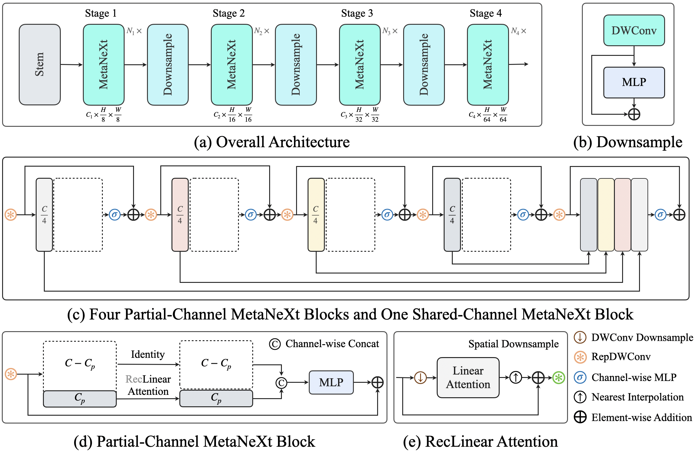
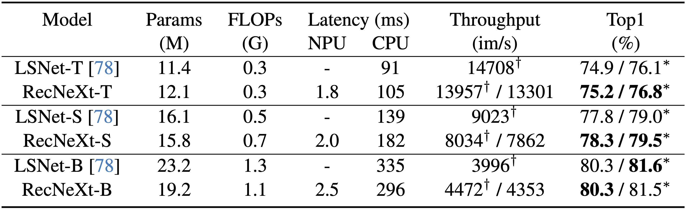

# More Comparisons

## Overall Architecture

We present a simple architecture, the overall design follows [LSNet](https://github.com/jameslahm/lsnet). This framework centers around sharing channel features from the previous layers.
Our motivation for doing so is to reduce the computational cost of token mixers and minimize feature redundancy in the final stage. 
We would greatly appreciate any helpful suggestions.



## ImageNet-1K Results



We evaluate **T**, **S**, **B** variants on ImageNet-1K, comparing them against the SOTA efficient architecture, [LSNet](https://github.com/jameslahm/lsnet). 
The NPU latency is measured on an iPhone 13 with models compiled by Core ML Tools. 
The CPU latency is accessed on a Quad-core ARM Cortex-A57 processor in ONNX format. 
And the throughput is tested on an Nvidia RTX3090 with maximum power-of-two batch size that fits in memory. 
**∗** denotes hard knowledge distillation using the RegNetY-16GF as the teacher model.

> We change the original triton code of [SKA module](https://github.com/THU-MIG/lsnet/blob/master/model/ska.py) to pytorch code for ARM CPU latency measurement.

```python
class SKA(nn.Module):
    def __init__(self, sks=3):
        super().__init__()
        self.sks = sks
        self.pad = sks // 2
        
    def forward(self, x, w):
        B, C, H, W = x.shape
        x = nn.functional.unfold(x, self.sks, padding=self.pad)       # [B, C*K*K, H*W]
        x = x.view(B, C, -1, H, W)                                    # [B, C, K*K, H, W]  
        return (x * w.repeat(1, C // w.shape[1], 1, 1, 1)).sum(dim=2) # [B, C, K*K, H, W] 
```

### With **Shared-Channel Blocks**

| Model |    Top-1     | Params | MACs | Latency |                                                                                                             Ckpt                                                                                                             |                                                                                                                 Fused                                                                                                                  |                                                                    Log                                                                    |                                                     Core ML                                                      |
|:------|:------------:|:------:|:----:|:-------:|:----------------------------------------------------------------------------------------------------------------------------------------------------------------------------------------------------------------------------:|:--------------------------------------------------------------------------------------------------------------------------------------------------------------------------------------------------------------------------------------:|:-----------------------------------------------------------------------------------------------------------------------------------------:|:----------------------------------------------------------------------------------------------------------------:|
| T     | 76.8 \| 75.2 | 12.1M  | 0.3G |  1.8ms  | [dist](https://github.com/suous/RecNeXt/releases/download/v2.0/recnext_t_share_channel_distill_300e.pth) \| [norm](https://github.com/suous/RecNeXt/releases/download/v2.0/recnext_t_share_channel_without_distill_300e.pth) | [dist](https://github.com/suous/RecNeXt/releases/download/v2.0/recnext_t_share_channel_distill_300e_fused.pt) \| [norm](https://github.com/suous/RecNeXt/releases/download/v2.0/recnext_t_share_channel_without_distill_300e_fused.pt) | [dist](./logs/distill/recnext_t_share_channel_distill_300e.txt) \| [norm](./logs/normal/recnext_t_share_channel_without_distill_300e.txt) | [dist](https://github.com/suous/RecNeXt/releases/download/v2.0/recnext_t_share_channel_distill_300e_224.mlmodel) |
| S     | 79.5 \| 78.3 | 15.8M  | 0.7G |  2.0ms  | [dist](https://github.com/suous/RecNeXt/releases/download/v2.0/recnext_s_share_channel_distill_300e.pth) \| [norm](https://github.com/suous/RecNeXt/releases/download/v2.0/recnext_s_share_channel_without_distill_300e.pth) | [dist](https://github.com/suous/RecNeXt/releases/download/v2.0/recnext_s_share_channel_distill_300e_fused.pt) \| [norm](https://github.com/suous/RecNeXt/releases/download/v2.0/recnext_s_share_channel_without_distill_300e_fused.pt) | [dist](./logs/distill/recnext_s_share_channel_distill_300e.txt) \| [norm](./logs/normal/recnext_s_share_channel_without_distill_300e.txt) | [dist](https://github.com/suous/RecNeXt/releases/download/v2.0/recnext_s_share_channel_distill_300e_224.mlmodel) |
| B     | 81.5 \| 80.3 | 19.2M  | 1.1G |  2.5ms  | [dist](https://github.com/suous/RecNeXt/releases/download/v2.0/recnext_b_share_channel_distill_300e.pth) \| [norm](https://github.com/suous/RecNeXt/releases/download/v2.0/recnext_b_share_channel_without_distill_300e.pth) | [dist](https://github.com/suous/RecNeXt/releases/download/v2.0/recnext_b_share_channel_distill_300e_fused.pt) \| [norm](https://github.com/suous/RecNeXt/releases/download/v2.0/recnext_b_share_channel_without_distill_300e_fused.pt) | [dist](./logs/distill/recnext_b_share_channel_distill_300e.txt) \| [norm](./logs/normal/recnext_b_share_channel_without_distill_300e.txt) | [dist](https://github.com/suous/RecNeXt/releases/download/v2.0/recnext_b_share_channel_distill_300e_224.mlmodel) |

### Without **Shared-Channel Blocks**

| Model |    Top-1     | Params | MACs | Latency |                                                                                               Ckpt                                                                                               |                                                                                                   Fused                                                                                                    |                                                      Log                                                      |                                              Core ML                                               |
|:------|:------------:|:------:|:----:|:-------:|:------------------------------------------------------------------------------------------------------------------------------------------------------------------------------------------------:|:----------------------------------------------------------------------------------------------------------------------------------------------------------------------------------------------------------:|:-------------------------------------------------------------------------------------------------------------:|:--------------------------------------------------------------------------------------------------:|
| T     | 76.6 \| 75.1 | 12.1M  | 0.3G |  1.8ms  | [dist](https://github.com/suous/RecNeXt/releases/download/v2.0/recnext_t_distill_300e.pth) \| [norm](https://github.com/suous/RecNeXt/releases/download/v2.0/recnext_t_without_distill_300e.pth) | [dist](https://github.com/suous/RecNeXt/releases/download/v2.0/recnext_t_distill_300e_fused.pt) \| [norm](https://github.com/suous/RecNeXt/releases/download/v2.0/recnext_t_without_distill_300e_fused.pt) | [dist](./logs/distill/recnext_t_distill_300e.txt) \| [norm](./logs/normal/recnext_t_without_distill_300e.txt) | [dist](https://github.com/suous/RecNeXt/releases/download/v2.0/recnext_t_distill_300e_224.mlmodel) |
| S     | 79.6 \| 78.3 | 15.8M  | 0.7G |  2.0ms  | [dist](https://github.com/suous/RecNeXt/releases/download/v2.0/recnext_s_distill_300e.pth) \| [norm](https://github.com/suous/RecNeXt/releases/download/v2.0/recnext_s_without_distill_300e.pth) | [dist](https://github.com/suous/RecNeXt/releases/download/v2.0/recnext_s_distill_300e_fused.pt) \| [norm](https://github.com/suous/RecNeXt/releases/download/v2.0/recnext_s_without_distill_300e_fused.pt) | [dist](./logs/distill/recnext_s_distill_300e.txt) \| [norm](./logs/normal/recnext_s_without_distill_300e.txt) | [dist](https://github.com/suous/RecNeXt/releases/download/v2.0/recnext_s_distill_300e_224.mlmodel) |
| B     | 81.4 \| 80.3 | 19.3M  | 1.1G |  2.5ms  | [dist](https://github.com/suous/RecNeXt/releases/download/v2.0/recnext_b_distill_300e.pth) \| [norm](https://github.com/suous/RecNeXt/releases/download/v2.0/recnext_b_without_distill_300e.pth) | [dist](https://github.com/suous/RecNeXt/releases/download/v2.0/recnext_b_distill_300e_fused.pt) \| [norm](https://github.com/suous/RecNeXt/releases/download/v2.0/recnext_b_without_distill_300e_fused.pt) | [dist](./logs/distill/recnext_b_distill_300e.txt) \| [norm](./logs/normal/recnext_b_without_distill_300e.txt) | [dist](https://github.com/suous/RecNeXt/releases/download/v2.0/recnext_b_distill_300e_224.mlmodel) |


```bash
fd txt logs -E refine -x sh -c 'printf "%.1f %s\n" "$(jq -s "map(.test_acc1) | max" {})" "{}"' | sort -k2
```

<details>
  <summary>
  <span>output</span>
  </summary>

```
81.4 logs/distill/recnext_b_distill_300e.txt
81.5 logs/distill/recnext_b_share_channel_distill_300e.txt
79.6 logs/distill/recnext_s_distill_300e.txt
79.5 logs/distill/recnext_s_share_channel_distill_300e.txt
76.6 logs/distill/recnext_t_distill_300e.txt
76.8 logs/distill/recnext_t_share_channel_distill_300e.txt
80.3 logs/normal/recnext_b_without_distill_300e.txt
80.3 logs/normal/recnext_b_share_channel_without_distill_300e.txt
78.3 logs/normal/recnext_s_without_distill_300e.txt
78.3 logs/normal/recnext_s_share_channel_without_distill_300e.txt
75.1 logs/normal/recnext_t_without_distill_300e.txt
75.2 logs/normal/recnext_t_share_channel_without_distill_300e.txt
```
</details>

## Latency Measurement

The latency reported in RecNeXt for iPhone 13 (iOS 18) uses the benchmark tool from [XCode 14](https://developer.apple.com/videos/play/wwdc2022/10027/).

<details>
<summary>
RecNeXt-T
</summary>

</details>

<details>
<summary>
RecNeXt-S
</summary>

</details>
<details>

<summary>
RecNeXt-B
</summary>

</details>

## Robustness Evaluation

Robustness evaluation on ImageNet-C, ImageNet-A, ImageNet-R, and ImageNet-Sketch.


## Promising refinement

Our quick experiments indicate that substituting Softplus for ELU as the linear attention kernel is a promising refinement:

1. It achieves higher cosine similarity compared to scaled dot-product attention.
2. It attains improved accuracy on the ImageNet-1K dataset.
3. It enables greater GPU throughput (measured on a RTX4090).

|       name       |  kernel  | cos_sim  | complexity | throughput | top1 |                                          log                                           |
|:----------------:|:--------:|:--------:|:----------:|:----------:|:----:|:--------------------------------------------------------------------------------------:|
|    attention     |    -     |    -     |   O(n^2)   |   17885    | 75.4 |   [log](logs/refine/recnext_t_without_distill_300e_scaled_dot_product_attention.txt)   |
| linear attention | softplus | 0.996636 |    O(n)    |   17839    | 75.3 | [log](logs/refine/recnext_t_without_distill_300e_linear_attention_softplus_kernel.txt) |
| linear attention |   elu    | 0.995216 |    O(n)    |   17796    | 75.2 |   [log](logs/refine/recnext_t_without_distill_300e_linear_attention_elu_kernel.txt)    |

```bash
python model/profile.py --seed 42 --resolution 8,8 --batch-size 16 --kernel softplus
# Cosine Similarity: 0.996636
```

```bash
python model/profile.py --seed 42 --resolution 8,8 --batch-size 16 --kernel elu
# Cosine Similarity: 0.995216
```

```bash
python model/profile.py --seed 42 --resolution 8,8 --batch-size 16 --kernel relu
# Cosine Similarity: 0.994811
```

```bash
fd txt logs/refine -x sh -c 'printf "%.1f %s\n" "$(jq -s "map(.test_acc1) | max" {})" "{}"' | sort -k2
```

<details>
  <summary>
  <span>output</span>
  </summary>

```
75.2 logs/refine/recnext_t_without_distill_300e_linear_attention_elu_kernel.txt
75.3 logs/refine/recnext_t_without_distill_300e_linear_attention_softplus_kernel.txt
75.4 logs/refine/recnext_t_without_distill_300e_scaled_dot_product_attention.txt
```
</details>